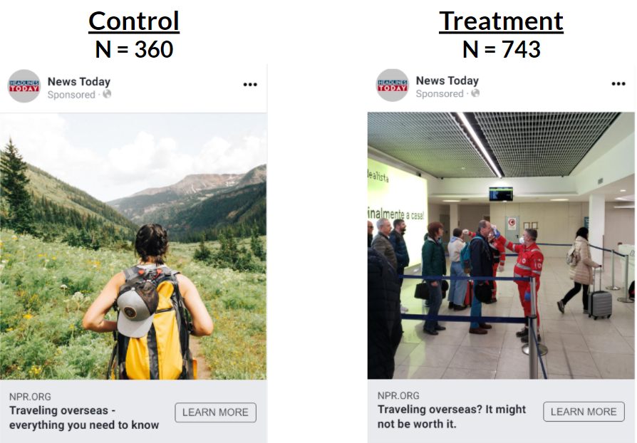
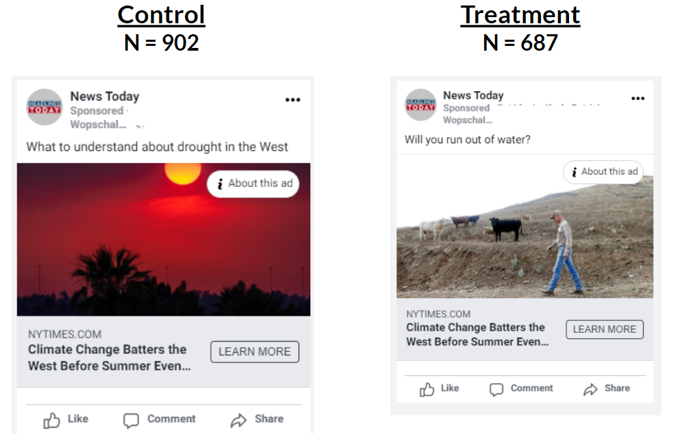
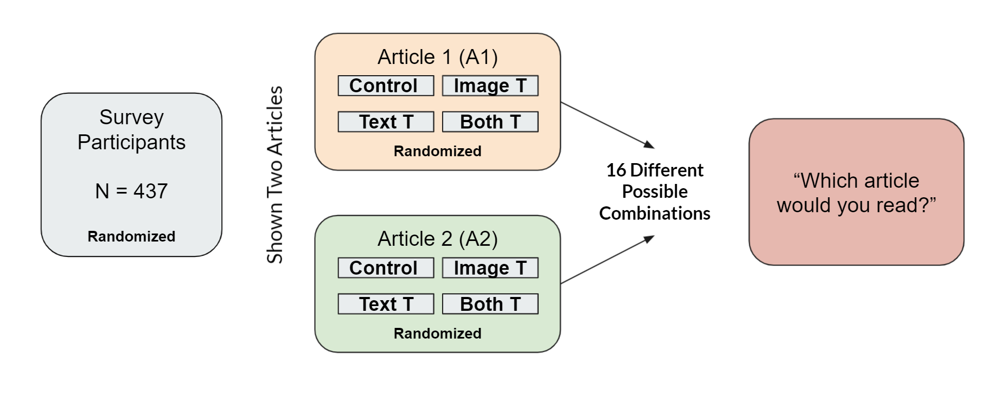
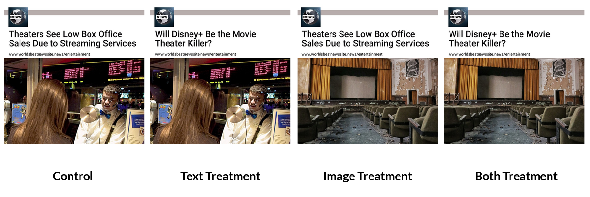
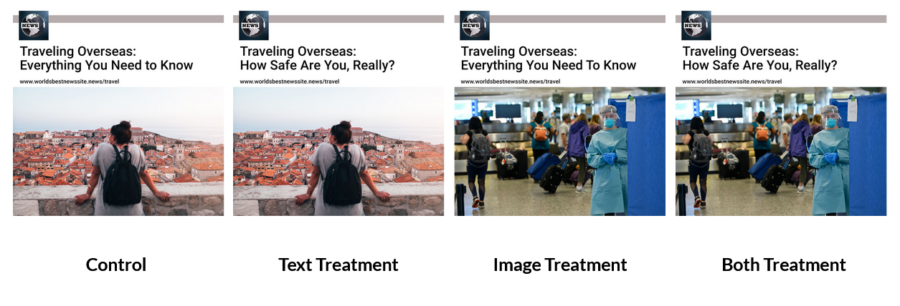
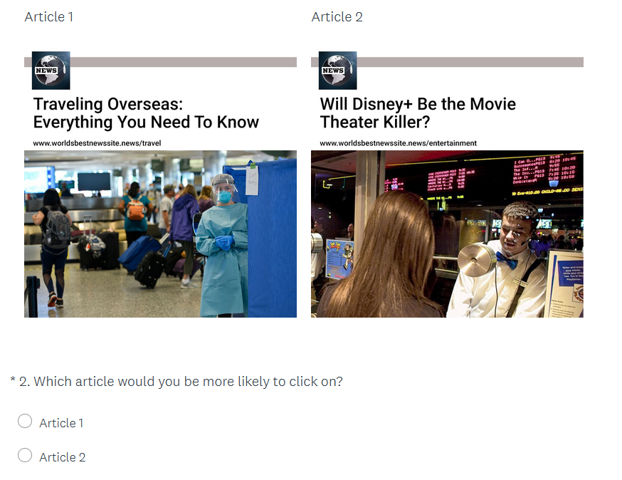
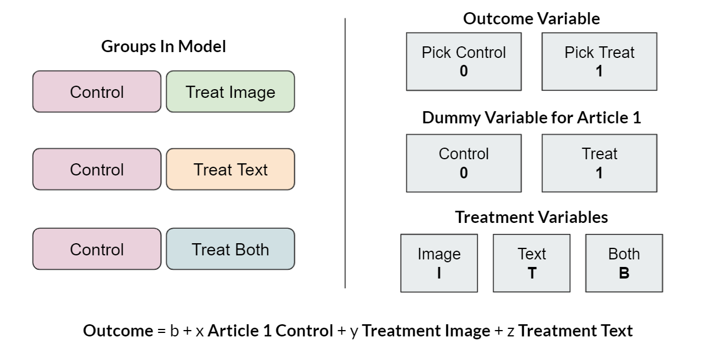
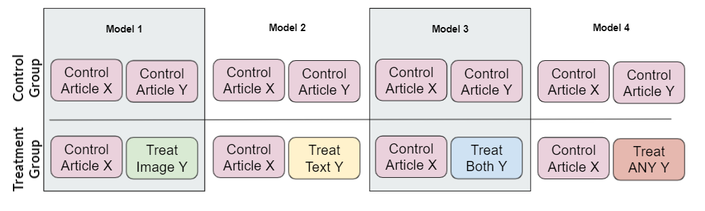
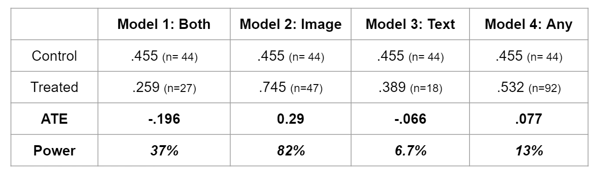
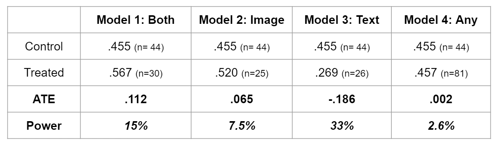

```{r setup, include=FALSE}
knitr::opts_chunk$set(echo = TRUE)
```

# Abstract 

We study the effect on click-through rates of applying textual and stylistic image often related to clickbait to headlines of newspaper articles which can be bought in a digital environment. Here we compare the impacts of changing headlines and images in both a social media platform, and survey format, to directly measure whether these “clickbait features” do what they're intended to do: entice readers to click on them. When testing articles related to travel during Covid and the drought in the West, our research shows evidence of increased clickthrough rates on the social media platform Facebook when both text and image is altered. The follow up with a survey style approach where we test a travel article and an article about streaming video and movie theater success, suggests there is strong correlation between altering image and text individually, and altering both, in respondents interest in the article (with no apparent effect of article content). However, further work is needed to ensure a sample size large enough to test for a signficant treatment effect. 


# Introduction

The way people consume newspaper articles is changing with more and more news consumption taking place online and through social media spaces as opposed to the traditional paper format. People used to buy a newspaper, read it from cover to cover while scanning headlines, and reading articles that they thought were interesting (Holmqvist et al. 2003). However, increasingly more people are reading individual articles online, outside of their original publication. Often, a person reads this article because it was shared on social media or some other internet platform. According to Journalism portal, in a 2017 survey, they found  two-thirds of readers utilized social media to get fresh news. 

With this change, the function of the headline of a news article changed as well. Previously, the primary function of a headline and image were to give the reader, who was scanning the newspaper, a clear understanding of what the article was about. By contrast, in social media the headline and image become primary ways to attract the reader's attention and make the reader curious as to what the article is about, so that it lures the reader to open the article. As a result, marketers and those looking to drive users to various websites have capitalized on changing these text and image components to sensationalize and grab readers attention. This leads to the main question: Can news sources use these same tactics to drive traffic to their articles?

Clickbait is a commonly explored device, with varied results (Mini, 2021). While clickbait, strictly defined, is the crafting of sensational headlines and images that lead to misleading content, we want to test the impact of the clickbait strategies within various other contexts(e.g. news, politics, popular science). As content developers, you’re constantly trying to drive engagement with readers, and structuring your meta content (headlines, subheadings, and images) on social media platforms should influence active engagement with your content, and the types of individuals you engage with. 

Here we craft two experiments to address if 1) a clickbait type ad, where both image and text are altered to be more sensationalized, leads to more clicks on a social media platform, and 2) if there are varying levels of impact from changing just text, just image, or both on survey respondents' interest in the articles. For both experiments, control ads contain headlines and images that are unemotional, factual, and generalized to address groups and not individuals. Treatment ads contain changes in image, headline text, or both, where these changes are designed to be more direct to an individual, emotional, and with an element of action. 

Experiment one is carried out on the social media platform Facebook, and compares control ads to treatment ads where both image and text are modified. We ran this experiment on two different underlying articles, one related to travel during the Covid-19 pandemic and the other related to the 2021 drought in the West of the United States. In an attempt to unpack the relative impacts of changing text, image, or both in our treatment groups, we launched a survey style experiment on the Survey Monkey platform. In this experiment, we created four different versions of each article tested: control, changing only text, changing only image, changing both. We created these four versions for two different articles, one related to travel during Covid-19 pandemic and the second related to video streaming services and the movie theater industry. Survey respondents were shown one version of each of these two articles, by random selection, and responded with the article they were most interested in reading. 

Results from both experiments suggest there is an impact towards click through rates and selection preference when treatment is applied. In our social media Facebook experiment we see strong evidence of a significant treatment effect for clickbait treatment on both image and text. When exploring the nuanced differences in impact between text, image, or both in the survey design, we see a strong correlation between treatements and article selection however suffer some issues with sample size and statistical power when attempting to answer the questions surrounding treatment effects when compared to control groups. 


# Facebook Ads Experiment

Facebook is one of the most widely used social media platforms in the United States, and an increasingly large source of news consumption. For this experiment we used their advertising platform that allows both clearly defining groups of individuals that see your advertisements and conduct A/B testing to ensure that there is no overlap between individuals that see the control and treatment versions of an advertisement. With high usership, and the testing platform in place, we were confident we could get a large sample of individuals in the experiment that don't overlap.

Data collected through the Facebook A/B testing platform includes those that have "seen" the article, meaning it showed up in their feed, those that click on the article, and various other engagement metrics such as comments and "likes". This allows us to identify individuals that would organically click on an article and have a reasonable measure of organic engagement. This should allow us to make the assumption that the effects applied by treatment are what is being measured in this comparison. However, its important to acknowledge that we have no insight to the Facebook algorithm and how their ad placement is truly selected. As a marketing platform, it is in their best interest to generate engagement quickly, and therefore there is likely some unknown confounding factors underlying the analyses. At the same time, we can assume this method is being done equally for the control and treatment advertisements, and that we should still be detecting a treatment effect despite the underlying algorithmic influences. 

## Experimental Design

Two experiments were run on the Facebook platform using two different underlying articles. For each experiment, we use one existing news article and design two ads for it, each with a title headline and an image. The control advertisement has both a headline and image that are neutral, informative, and passive. They state facts without a call to action or question for the reader, and the image should not elicit strong emotional reactions. For the treatment advertisement, both the headline and image are "clickbait" - the headline contains a question that entices the reader to click on the article to find the answer, and the image portray more dynamic action that might draw attention. 

Both control and treatment advertisements sit on top of an identical article, with identical news source, and therefore an identical subtitle (Figures 1 and 2). It is likely individuals have preferences on news sources and websites for their news consumption, and to eliminate any clicks that were related to preferences outside of the targeted treatment impacts. 

The first experiment (Figure 1) uses the same NPR article about traveling overseas during the pandemic. The control group sees the headline "Traveling overseas - everything you need to know" with an image of a woman hiking in an idyllic nature scene. The treatment group sees the headline "Traveling overseas? It might not be worth it" with an image of travelers getting their temperatures checked in an airport security line. This article reached a total of 1103 individuals, with 360 seeing the control advertisement and 743 seeing the treatment advertisement.

```{r, echo=FALSE, fig.cap="Facebook Pilot Experiment 1", out.width = '50%', fig.align = "center", fig.pos = "H"}

```

The second experiment (Figure 2) uses a New York Times article about the drought on the West Coast. The control group sees the headline "What to understand about the drought in the west" with an image of a red fiery sky. The treatment group sees the headline "Will you run out of water?" with a farmer walking on barren land in front of a few cows. A total of 1,589 individuals were in this experiment, with 902 seeing the control article and 687 seeing the treatment article. 

```{r, echo=FALSE, fig.cap="Facebook Pilot Experiment 2", out.width = '50%', fig.align = "center", fig.pos = "H"}

```

Each experiment ran for less than two days. The initial experimental design intended to run the experiments for a week each, however the Facebook platform shut down the business page developed to run these ads. Facebook has been implementing new policies to track "fake news", and the assumption is that the business page from which we created ads is brand new, and we did not have much, if any, previously advertising records on Facebook, our respective advertising accounts got disabled by Facebook. It was eye opening to see efforts being made by social media platforms to limit "fake news", even though it was a big roadblock for this experiment. However, these initial experiments still generated enough data to analyze and see meaningful results.


## Analysis

### Regression Model 

To assess the impact of the treatment, we ran a regression analysis. This is a linear regression model of the variable click on the variable treated - both indicator variables. Click indicates whether a Facebook user clicked through to the article after seeing the ad, and treated indicates if a user is in the treatment group. Table 1 shows the results. The first column shows the results from the first pilot study using the travel ads. The coefficient on treated is 0.122 with a 0.00 p-value, meaning that people in the treatment group are 12.2% more likely to click on the ad. The second column shows results from the second pilot study using the drought ads. The coefficient on treated is 0.020 with a p-value of 0.0691. People in the treatment group are 2.0% more likely to click on the ad, but it is only only statistically significant at the 10% level, compared to the 1% level in the first pilot study. 

```{r, message=FALSE, warning=FALSE, include = FALSE}
library(data.table)
library(sandwich)
library(lmtest)
library(stargazer)
library(ggplot2) 

robust_se <- function(mod, type = 'HC3') { 
  sqrt(diag(vcovHC(mod, type)))
  }
```

```{r load data, include = FALSE}
d_fb <- fread('data/fb_data_detail.csv')
d_fb[ , treated := adsetname == 'Treatment']
d_fb[ , female := gender=='female']
d_fb[ , mean(click), by = treated]

d2 <- fread('data/fb_data_detail_2.csv')
d2[ , treated := adsetname == 'Treatment']
d2[ , female := gender=='female']
d2[ , mean(click), by = treated]
```

```{r simple model, results='asis', echo=FALSE}
model1 <- d_fb[ , lm(click ~ treated)]
model2 <- d2[ , lm(click ~ treated)]
stargazer(model1 , model2, 
          type = 'latex',
          se = list(robust_se(model1), robust_se(model2)),
          header = FALSE,
          title = 'Facebook experiment - click regressed on treated',
          column.labels = c('travel ads', 'drought ads')
          )
cat('\\newpage') #For some reason, the stargazer model leaks to the next page without this fix

```
### Covariate Check 

Since Facebook's algorithms randomized our populations for the experiments and their business goals are presumed to be focused on revenue from advertisers, we conducted covariate checks to ensure that randomization was done properly. We conducted a regression of treated on female to see if gender predicted which group a user would fall in. The female coefficient is not statisticaly significant in the travel ads experiment, but it is significant at the 10% level in the drought ads experiment.

```{r fb test covariates gender, echo = FALSE, message = FALSE, warning = FALSE, results = 'asis', fig.pos = "H"}
test_gender <- d_fb[ , lm(treated ~ female)]
test_gender2 <- d2[ , lm(treated ~ female)]

stargazer(test_gender, test_gender2,
          type = 'latex',
          se = list(robust_se(test_gender),
                    robust_se(test_gender2)),
          title = 'Facebook experiment - covariate check - gender',
          column.labels = c('travel ads', 'drought ads'),
          header = FALSE
          )

```

We ran a similar regression of treated on age. Age was provided from facebook in buckets: 18-24, 25-34, 35-44, 45-54, 55-64 and 65+. The regression results effectively compare each age group to the 18-24 group. For both the travel ads experiment and the drought ads experiment, all coefficients on age groups are positive. None of the coefficients are statistically significant in the travel ads experiment, but they are all statistically significant at different levels for the drought experiment. Without other covariates or a deeper understanding of Facebook's algorithm, it is difficult for us to tell why these the drought experiment's randomization may not have been done properly.

```{r fb test covariates age, echo = FALSE, message = FALSE, warning = FALSE, results = 'asis', fig.pos = "H"}
test_age <- d_fb[ , lm(treated ~ as.factor(age))]
test_age2 <- d2[ , lm(treated ~ as.factor(age))]

stargazer(test_age, test_age2,
          type = 'latex',
          se = list(robust_se(test_age),
                    robust_se(test_age2)),
          title = 'Facebook experiment - covariate check - age',
          column.labels = c('travel ads', 'drought ads'),
          header = FALSE
          )

cat('\\newpage')
```


### Hetereogenous Treatment Effects

We also tested for heterogeneous treatment effects (HTE) among genders and age groups using data from the travel ads experiment. The left column below is the simple model that regressed click on treated, as shown previously. Column 2 shows regression that adds female and an interaction term $female \times treated$. The the result is $click = 0.037 + 0.093treated - 0.009female + 0.043treated \times female$. The coefficients for $female$ and for the interaction term are not statistically significant. 

To test for HTE among age groups, we separated the population into below 45 and 45 or above. The results are shown in the third column below as: $click = 0.000 + 0.107treated + 0.032over45 + 0.018treated\times over45$. The coefficient on $over45$ is statistically significant at the 1% level, while the coefficient on $treated\times over45$ is not statistically significant. This indicates that people older than 45 are at least 3.2% more likely to click on the article. 

```{r fb HTE, echo = FALSE, message = FALSE, warning = FALSE, results = 'asis', fig.pos = "H"}
d_fb[ , female := gender == 'female']
d_fb[ , over45 := age %in% c('45-54', '55-64', '65+')]

model_gender <- d_fb[gender != "unknown", lm(click ~ treated + female + treated * female)]
model_age <- d_fb[ , lm(click ~ treated +  over45 + over45 * treated)]

stargazer(model1 , model_gender,  model_age, 
          type = 'latex',
          se = list(robust_se(model1),
                    robust_se(model_gender),
                    robust_se(model_age)),
          title = 'Facebook experiment - hetereogeneous treatment effects',
          header = FALSE
)
```

### Facebook Results 

Overall, the results from the Facebook experiments suggest there is a significant treatment effect when both the image and text are treated with our "clickbait" treatment. This leads to the next question: do image or text have different impacts? To test the relative impacts of treating text, image, or both, we moved forward with additional experimentation. Due to issues with the Facebook platform, we transitioned to a survey design platform: Survey Monkey.

# Survey(Survey Monkey) Experiment 

The Survey Experiment was designed to test the relative impact of applying a treatment to just the text, just the image, or both for our advertisements and articles. As noted previously, due to issues with the Facebook platform we transitioned to a survey space that would allow us to complete the experiment: Survey Monkey.

SurveyMonkey is a survey platform that allows for surveying users cheaply and efficiently with little danger of being locked out of the platform. The respondent is shown two image ads and asked to indicate which ad they would be more likely to click on. The survey targeted 400 respondents from across the United States using the broadest demographic available on SurveyMonkey. The full dataset contains 437 responses as SurveyMonkey provided these extra responses for free.

When working with SurveyMonkey there are a few key differences to note. On the Facebook platform, Facebook users were randomly shown a single article in their news feed and could choose to engage with the article or not. This very accurately mirrors a natural environment in which the participants are not aware they are being experimented on. This is an ideal situation for collecting true treatment effects. In the survey experiment this is not the case. Individuals are opting in to take surveys, and by default know their responses are being measured. Secondly, they are shown two images of potential articles and asked to identify their preferences. This is a forced choice. Individuals who may not be interested in either article, and if shown these in an environment like Facebook would click on neither, are requested to make a selection. This is likely to decrease the treatment effect and make it more difficult to identify, since individuals who otherwise would not participate are now required to log a response. 

## Experimental Design

SurveyMonkey contains an A/B testing feature that allows for different text and images to be shown to respondents at random. We utilize this feature to show two different images to the respondent and create many sampling pairs. First, two ads with tame language and normal stock images were created by the team. For each ad, one version is created with extreme language in the title, another version with a shocking image, and a final version with both modified at once. This means that there are four versions of each article, and each version has a 25% chance of being displayed to the respondent according to SurveyMonkey's randomization procedure. 


```{r, echo=FALSE, fig.cap="Survey Design", out.width = '85%', fig.align = "center", fig.pos = "H"}

```


```{r, echo=FALSE, fig.cap="Article 1", out.width = '85%', fig.align = "center", fig.pos = "H"}

```


```{r, echo=FALSE, fig.cap="Article 2", out.width = '85%', fig.align = "center", fig.pos = "H"}

```

Since there are two ads and four possible versions of each ad, this creates 16 possible pairings, meaning that each pairing has a 1 in 16 chance of appearing in a respondent's survey.


```{r, echo=FALSE, fig.cap="Survey Sample", out.width = '85%', fig.align = "center", fig.pos = "H"}

```


## Results 

``` {r survey analysis, results = 'asis', message = FALSE, warning = FALSE, error = FALSE, echo = FALSE}
library(dplyr)
library(ggplot2)
library(tidyr)
library(sandwich)
library(stargazer)
library(lmtest)

d <- read.csv(file = 'data/News Pulse.csv')
d <- as.data.frame(d)

#Data cleaning
d <- d[-1,]
df <- d %>% select(c("Respondent.ID", "What.type.of.news.are.you.most.interested.in.", 
                    "Article.1", "Article.2", "Which.article.would.you.be.more.likely.to.click.on.",
                    "How.interested.are.you.in.the.news.on.a.scale.of.1.to.10.", "Gender",
                    "Household.Income", "Device.Type", "Region", "Age"))
colnames(df) <- c("id", "news_interest", "article1", "article2", "article_pref", 
                 "news_interest_score", "gender", "household_income", "device_type", 
                 "region", "age")

#Replaces article column values with something more manageable
#Change article preference to a binary variable
article_helper <- function(line) {
  if(line == "Text Treatment") {"T"}
  else if(line == "Image Treatment") {"I"}
  else if(line == "Text and Image Treatment") {"B"}
  else {"C"}
}


df <- df %>% mutate(article1 = sapply(article1, article_helper, USE.NAMES=FALSE),
                  article2 = sapply(article2, article_helper, USE.NAMES=FALSE),
                  article_pref = ifelse(article_pref == "Article 1", 0, 1))

#Helper function for prop testing
prop_test_helper <- function(group, data = df) {
  filtered_data <- data %>% filter(article1 == group & article2 == group)
  prop.test(sum(filtered_data$article_pref), length(filtered_data$article_pref))
}

#Test of proportions for each treatment group pair
prop_test_p_values <- c()
for (g in c("C", "I", "T", "B")) {
  prop_test_p_values[g] <- prop_test_helper(g)$p.value
}

```

Respondents only ever see one version of each ad, which means that the potential outcomes of a respondent observing a treated ad and a control ad are never observed. To overcome this problem, a test of proportions is used as a basic check to determine whether the difference in ad content or topics has a significant effect on respondent choices. For each treatment type, we compare the number of times that ad version was selected by the respondents between both ads, and the p-values obtained are outlined below.

#### Test of Proportion P-values

* Control group - those who saw control images of both articles: `r prop_test_p_values["C"]`
* Text treatment group - those who saw text treatment of both articles: `r prop_test_p_values["T"]`
* Image treatment group - those who saw image treatment for both articles: `r prop_test_p_values["I"]`
* Both treatment group - those who saw both text and image treatment on both articles: `r prop_test_p_values["B"]`

For all groups we see no statistically significant differences in preference for article one versus article two, suggesting content and topic are not driving the outcome. 

#### Test of Article Preference Through Regression Analysis

Due to small sample sizes, we also ran a regression on a subset of the dataset containing all of the groups outlined above (e.g. those who saw the same type of both articles). Here we have the outcome variable set as preferring article one, and covariates for potential treatment types. We see, even when aggregated, there is no evidence of individuals in the survey preferentially selecting one article over the other when both articles have equal levels of treatment. Therefore, there is no evidence that article content is driving article selection, and we can assume that effects seen are driven by differences in treatment. 

```{r article preference regression, results = 'asis', message = FALSE, warning = FALSE, error = FALSE, echo = FALSE}
df_3 <- subset(df, (article1 == article2))

df_3$treatment <- df_3$article1


library(stargazer)
model_df3 <- lm(article_pref ~ treatment , data = df_3 )
#model_df3
model_df3.Coeftest <- coeftest(model_df3, vcovHC(model_df3))
#stargazer(model_df3, se=list(sqrt(diag(vcovHC(model_df3)))), type = 'text', header = F)

stargazer(model_df3,
          type = 'latex',
          se = list(robust_se(model_df3)),
          title = 'Survey Monkey experiment - article content preference check',
          column.labels = c('groups'),
          header = FALSE
          )
```


### Treatment Type Impacts at the Individual Level

To test the impact of treatment types at the individual level, we subset the data to remove all individuals that saw identical treatment levels (e.g. control article one and control article two; treatment both article one and two, etc). This left us with individuals that all have one control article, and see one type of treatment article, then make the choice between the two for their preference. 


```{r, echo=FALSE, fig.cap="Individual Treatement Design", out.width = '85%', fig.align = "center", fig.pos = "H"}

```

#### Regression Analyses and Results

When running a regression, we create a dummy variable that notes whether article one is control or treatment, and retain variables for the types of treatments that were seen (Image, Text, or Both). Our outcome variable is whether the treatment article was selected or not. 

```{r survey regression, results = 'asis', message = FALSE, warning = FALSE, error = FALSE, echo = FALSE}
#Duplicating dataframe df to build off of - filtering down to remove like:like pairs
#Removes data without a Control

df$control_present <- ifelse(df$article1 == 'C', 1, ifelse(df$article2== 'C', 1, 0))
df2 <- subset(df, article1 != article2 & control_present == 1)

##Coding variable that shows if Article 1 is control
df2$article1_control <- ifelse(df2$article1== 'C', 1, 0)

##Add variable that has the outcome as 1 picked treatment 0 picked control
df2$outcome <- ifelse(df2$article_pref == 1 & df2$article1 == 'C', 0, ifelse(df2$article_pref == 0 & df2$article2 == 'C', 0, 1))

##Add column with treatment type 
df2$treatment_type <- ifelse(df2$article1 == 'C', df2$article2, df2$article1)

model_df2 <- lm(outcome ~ article1_control + treatment_type , data = df2 )
#model_df2
model_df2.Coeftest <- coeftest(model_df2, vcovHC(model_df2))
#stargazer(model_df2, se=list(sqrt(diag(vcovHC(model_df2)))), type = 'text', header = F)

stargazer(model_df2,
          type = 'latex',
          se = list(robust_se(model_df2)),
          title = 'Survey Monkey experiment - regression of covariates',
          header = FALSE
          )
```

From these results we see that when Article One is the control, respondents that are shown an image with "Both" image and text are 67% more likely to select the treatment article over the control article. When the treatment variable is just image, the percentages decrease by 31%, suggesting that when looking at Article One control and Article Two with a treatment image they are 36% more likely to select the treatment article. If the treatment applied is "Text", the overall likelihood of selecting the treatment article is 45%. When article two is made the control, all of these percentages decrease by 4.3%.

Overall, this suggests significant impacts of all types of treatments. The largest treatment impact belonging to the cases where both image and text are changed, followed by text being the second most impactful, and images being the third most impactful.

## Treatment Type Impacts at the Group Level

While it appears that these variables correlate on an individual level with article selection, our next question was focused around if we see any statistical significance when compared to a control group. To answer this question we ran four different models with the following comparisons as control and treatment:

```{r, echo=FALSE, fig.cap="Control and Treatment Groups", out.width = '85%', fig.align = "center", fig.pos = "H"}

```

The treatment group that includes "ANY" treatment is an aggregation of the prior three models/groups. This was run twice for article one and two - where each article is independently run for being the control.


#### Article One as Control

Keeping article one as control we see an average treatment effect of the following for each comparison:

```{r, echo=FALSE, fig.cap="Article One as Control: Summary Statistics", out.width = '85%', fig.align = "center", fig.pos = "H"}

```

When regressing for these variables where article one is always the control we see the following results:

```{r article one control regression, results = 'asis', message = FALSE, warning = FALSE, error = FALSE, echo = FALSE}

# article 1 is always control, article 2 is control + treatment

robust_se <- function(mod, type = 'HC3') { 
  sqrt(diag(vcovHC(mod, type)))
  }

df3a <- subset(df, article1 == "C" & (article2 == "C" | article2== "B"))
df3a$treated <- df3a$article2 == "B"

df3b <- subset(df, article1 == "C" & (article2 == "C" | article2== "I"))
df3b$treated <- df3b$article2 == "I"

df3c <- subset(df, article1 == "C" & (article2 == "C" | article2== "T"))
df3c$treated <- df3c$article2 == "T"

df3d <- subset(df, article1 == "C")
df3d$treated <- df3d$article2 != "C"
  
model_a1c_a2b <- lm(article_pref ~ treated, data = df3a)
model_a1c_a2i <- lm(article_pref ~ treated, data = df3b)
model_a1c_a2t <- lm(article_pref ~ treated, data = df3c)
model_a1c_a2any <- lm(article_pref ~ treated, data = df3d)

stargazer(model_a1c_a2b, model_a1c_a2i, model_a1c_a2t, model_a1c_a2any,
          se=list(robust_se(model_a1c_a2b), robust_se(model_a1c_a2i), 
                  robust_se(model_a1c_a2t), robust_se(model_a1c_a2any)), 
          type = 'latex', 
          title = 'Survey Monkey experiment - Group Comparisons',
          header = F,
          column.labels = c("Both", "Image", "Text", "Any Treatment"))
```

With Article One as our control, we can see that there appears to have a significant effect when looking at the Image treatment of .290, and a negative effect when looking at comparisons with "Both" image and text treatment of -.195. However, when looking at our summary statistics and power of these tests we can note that by parsing our data in this manner we are now working with small samples sizes and low power. Interestingly, our one variable that shows a positive significant positive correlation in our regression, the articles with image treatment, is the only group comparison that has a high power associated. 

From these results, we can lend more evidence that there may be some impact related to these treatment effects, however with this particular analyses we suffer a sample size issue to better articulate the nuance of those impacts. 

#### Article Two as Control

Keeping article two as control we see an average treatment effect of the following for each comparison:

```{r, echo=FALSE, fig.cap="Article Two as Control: Summary Statistics", out.width = '85%', fig.align = "center", fig.pos = "H"}

```

When regressing for these variables where article two is always the control we see the following results:

```{r article two control regression, results = 'asis', message = FALSE, warning = FALSE, error = FALSE, echo = FALSE}

# article 2 is always control, article 1 is control + treatment

df$choose_article1 <- df$article_pref == 0
df4a <- subset(df, article2 == "C" & (article1 == "C" | article1== "B"))
df4a$treated <- df4a$article1 == "B"

df4b <- subset(df, article2 == "C" & (article1 == "C" | article1== "I"))
df4b$treated <- df4b$article1 == "I"

df4c <- subset(df, article2 == "C" & (article1 == "C" | article1== "T"))
df4c$treated <- df4c$article1 == "T"

df4d <- subset(df, article2 == "C")
df4d$treated <- df4d$article1 != "C"

model_a2c_a1b <- lm(choose_article1 ~ treated, data = df4a)
model_a2c_a1i <- lm(choose_article1 ~ treated, data = df4b)
model_a2c_a1t <- lm(choose_article1 ~ treated, data = df4c)
model_a2c_a1any <- lm(choose_article1 ~ treated, data = df4d)

stargazer(model_a2c_a1b, model_a2c_a1i, model_a2c_a1t, model_a2c_a1any,
          se=list(robust_se(model_a2c_a1b), robust_se(model_a2c_a1i), 
                  robust_se(model_a2c_a1t), robust_se(model_a2c_a1any)), 
          type = 'latex', 
          title = 'Survey Monkey experiment - Group Comparisons',
          header = F,
          column.labels = c("Both", "Image", "Text", "Any Treatment"))

```


With Article Two as our control, we see no statistically significant coefficients with our regressions, however we also see from the summary table that we are suffering from a power issue related to our sample sizes. 

At this time its best to use these group comparisons as evidence of a potential impact, seeing as our one comparison with power shows a significant coefficient, however further work to grow our sample size needs to be pursued before anything concrete can be concluded. 

# Conclusions 

In the Facebook ads platform experiment, the results suggest that with ‘clickbait’ images and text get significantly more clicks. We see this significant impact for both articles that were tested. However, it is difficult to test from this limited experiment whether the treatment effect we see is driven by the change in the headline text, the image, or the combination of both. 

When attempting to test these nuanced variations in treatment on the SurveyMonkey platform, we see a strong correlation for all treatment types and selecting a treatment article over control. It appears that the largest impact comes from having both image and text treatments, with only text treatment as next impactful, followed by only image. While these appear to have a strong correlation, when we parse the data to do a comparison between control groups we see these impacts disappear and in some cases reverse. However, once we parse our data to compare control and treatment groups, we see we have significant issues with sample size and low power analyses. Then only test with significant power corresponds to the positive treatment effect of an image treatment. These results suggest that there is evidence that supports these treatment types do impact click through rates, however further work to grow the sample size for the latter survey experiment is warranted. 

Further work should focus on identifying a platform that can mimic the Facebook environment more closely, to avoid the forced choice and known testing space, and ultimately receive less leading results. In addition, expanding these studies to test for impact by article type and content would help contextualize if this treatment effect is only observed in some spaces and/or its magnitude changes for different types of content (e.g. politics, sports, etc.). In addition, as news sources continue to become more divisive and bi-partisan in the United States, running a larger experiment to test the contextual impact on the underlying news source would provide a more wholistic picture of indivudal choice when clicking on content. 


